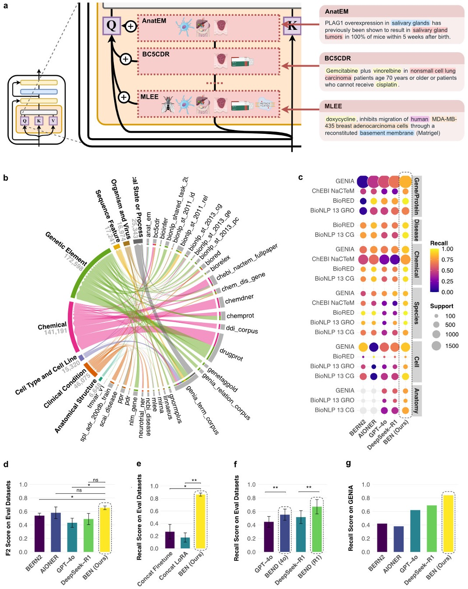

# BEN: A Modular Ensemble for High-Recall Biomedical NER in Resource-Efficient Settings

**BEN** is a biomedical **named entity recognition (NER)** system that identifies and classifies entities in scientific/clinical text using a PubMedBERT backbone with **parameter‑efficient (PEFT / LoRA) adapters**. It supports **ensemble prediction across domain‑specific adapters**, long‑document segmentation with overlap handling, and confidence scoring from token‑level probabilities.



---

## Features

* **Backbone:** PubMedBERT encoder for biomedical text understanding
* **Adapters:** 35+ **PEFT/LoRA** adapters trained per dataset/domain; load a subset per task
* **Ensemble:** Merge predictions across adapters; restrict with `datasets=[...]` when needed
* **Long documents:** Sliding‑window **segmentation with overlaps**, plus overlap‑aware score fusion
* **Confidence scores:** Span confidence from **geometric mean of token‑level probabilities**
* **Practical niceties:** Stop‑word filtering, boundary clean‑up, duplicate span merging, batch loops

---

## Quick Start

### Installation

```bash
pip install torch transformers peft datasets loguru nltk seqeval tqdm pandas numpy
# (Optional) If you need NLTK tokenizers:
python - <<'PY'
import nltk
nltk.download('punkt')
PY
```

### Basic Usage

```python
from src.prediction import load_model, extract_entities

# 1) Load the model and adapters (one-time setup)
load_model(device="cuda:0")  # or "cpu"

# 2) Extract entities from text
text = "Aspirin is used to treat cardiovascular disease in patients with diabetes."
result = extract_entities(text)

print(result["entities"])
# -> nested dict: {ENTITY_TYPE: {term: {"start:end": prob, ...}, ...}, ...}
```

### Advanced Usage

```python
# Use a subset of adapters; include scores, spans, and provenance; filter by prob.
result = extract_entities(
    text="The patient was treated with metformin for type 2 diabetes.",
    datasets=["bc5cdr", "ncbi_disease"],  # restrict to specific domain adapters
    return_probs=True,     # add confidence scores
    return_sources=True,   # include which adapter(s) fired
    return_spans=True,     # include "start:end" character offsets
    min_prob=0.50          # drop low-confidence spans
)

entities = result["entities"]
stats    = result["stats"]
print(f"Elapsed: {stats['elapsed']}s | Unique terms: {stats['num_terms']}")
```

> **Batching tip.** For a list of documents, call `extract_entities` inside a simple loop (or with `tqdm`)—the pipeline already batches *segments* internally.

---

## Output Format

```python
{
  "entities": {
    "CHEMICAL": {
      "aspirin": { "0:7": 0.95 }
    },
    "CLINICAL_CONDITION": {
      "cardiovascular disease": { "25:46": 0.87 }
    }
  },
  "stats": {
    "num_chars": 67,
    "elapsed": 0.234,
    "num_categories": 2,
    "num_terms": 2,
    "num_segments": 1
  }
}
```

* Keys under `"entities"` are **entity types**; terms group their **character spans** (`"start:end"`) with **probabilities**.
* `"stats"` summarizes processing metadata per call.

---

## Entity Categories

BEN’s default taxonomy supports **up to 15 biomedical entity types** (schema is configurable per build). Common categories include:

* **Chemical** — synthetic/natural substances
* **Genetic Element** — genes, proteins, nucleic acids
* **Clinical Condition** — diseases, signs/symptoms
* **Organism or Virus** — species, strains, viruses
* **Anatomical Structure** — organs, tissues, systems
* **Cell Type or Cell Line** — primary/cultured cell types/lines
* **Biomedical Procedure or Device** — procedures, instruments, devices
* **Health Indicator** — lab tests, measurements, metrics
* **Biologic State or Process** — biological functions/processes
* **Sequence Feature** — domains/motifs (e.g., binding sites)

> The exact set exposed at runtime depends on which adapters you load. Check your taxonomy/config files for the full list in this build.

---

## Model Architecture (at a glance)

1. **Base Model:** PubMedBERT (encoder‑only) frozen for inference
2. **PEFT/LoRA Adapters:** 35+ **domain‑specific adapters** trained on different datasets
3. **Ensemble Prediction:** Adapter outputs are merged at **span level** with type alignment
4. **Text Segmentation:** Long inputs are split into overlapping windows; **overlap fusion** smooths scores across boundaries

---

## How It Works

* **Segmentation & Overlap fusion:** Text is split into fixed‑length windows with overlap. Spans near window edges are scored in multiple windows; BEN fuses these via overlap‑aware weighting to stabilize boundaries.
* **Scoring:** Span confidence = **geometric mean** of token‑level probabilities contributing to the span.
* **Boundary clean‑up:** A `NamedEntity` helper normalizes whitespace/punctuation, trims stop‑words, collapses duplicates, and reconciles overlaps.
* **Adapter ensemble:** Each adapter contributes spans; ensemble merges spans of the **same text + type** (union of segments/adapters), keeping the highest or fused score.

---

## Controlling Which Adapters Run

* **All adapters (default):** `extract_entities(text)`
* **Subset by dataset:** `extract_entities(text, datasets=["bc5cdr", "ncbi_disease", ...])`
* **Confidence thresholding:** `min_prob=0.5` (or higher for precision‑oriented runs)
* **Provenance:** `return_sources=True` to see which adapter(s) fired per span

---

## Performance Notes

* **GPU acceleration:** Use `device="cuda:0"` when available for fastest inference.
* **Throughput:** Prefer many **short texts** over one very long text when possible; BEN already overlaps segments internally.
* **Memory:** Keep the number of simultaneously loaded adapters reasonable on limited GPUs; or restrict with `datasets=[...]`.
* **Reproducibility:** Minor variations can occur due to segmentation boundaries and tokenization; fix random seeds where applicable.

---

## Project Structure (typical)

```
.
├─ src/
│  ├─ prediction.py        # load_model, extract_entities, helpers
│  ├─ adapters/            # PEFT/LoRA adapter configs/weights (per dataset)
│  ├─ taxonomy/            # category schema, mapping utilities
│  ├─ utils/               # text cleanup, span ops, scoring, I/O
│  └─ ...
├─ configs/                # adapter lists, thresholds, segmentation params
├─ examples/               # sample texts & notebooks
├─ tests/                  # unit tests
└─ README.md
```

> If your layout differs, adjust the paths referenced above (e.g., where adapters live).

---

## Troubleshooting

* **`ModuleNotFoundError` (NLTK data):** Run the `nltk.download('punkt')` snippet shown in *Installation*.
* **CUDA OOM:** Reduce the number of active adapters via `datasets=[...]`, or lower window length/stride in your config.
* **No entities found:** Lower `min_prob`, or broaden the adapter set. Confirm your text language/domain matches available adapters.

---

## Data Availability

- **UMLS semantic types**: [Current list](https://www.nlm.nih.gov/research/umls/META3_current_semantic_types.html)
- **BigBio datasets**: [Hugging Face BigBio](https://huggingface.co/bigbio)
- **BEN inference outputs (NER spans)**: [Hugging Face dataset](https://huggingface.co/john-dope/datasets)
- **Base model weights**: [BiomedBERT base uncased abstract+fulltext](https://huggingface.co/microsoft/BiomedNLP-BiomedBERT-base-uncased-abstract-fulltext)
- **BEN LoRA adapter weights**: [Hugging Face models](https://huggingface.co/john-dope/models)

---

## Code Availability

- **Source code, prompts, mappings, examples**: [BioMedBigDataCenter/BEN](https://github.com/BioMedBigDataCenter/BEN)
- **Interactive demo server**: [biosino.org/ben/home](https://www.biosino.org/ben/home)

---

## License

See `LICENSE`. Unless noted, the code is for research use.

---

## Citation

If you find this project useful, please cite the repository (update with authors/title as appropriate):

```
@software{ben_ner,
  title  = {BEN: A Modular Ensemble for High-Recall Biomedical NER in Resource-Efficient Settings},
  year   = {2025},
  url    = {https://github.com/BioMedBigDataCenter/BEN},
  note   = {NER system with 32 LoRA adapters and 8-category schema}
}
```
